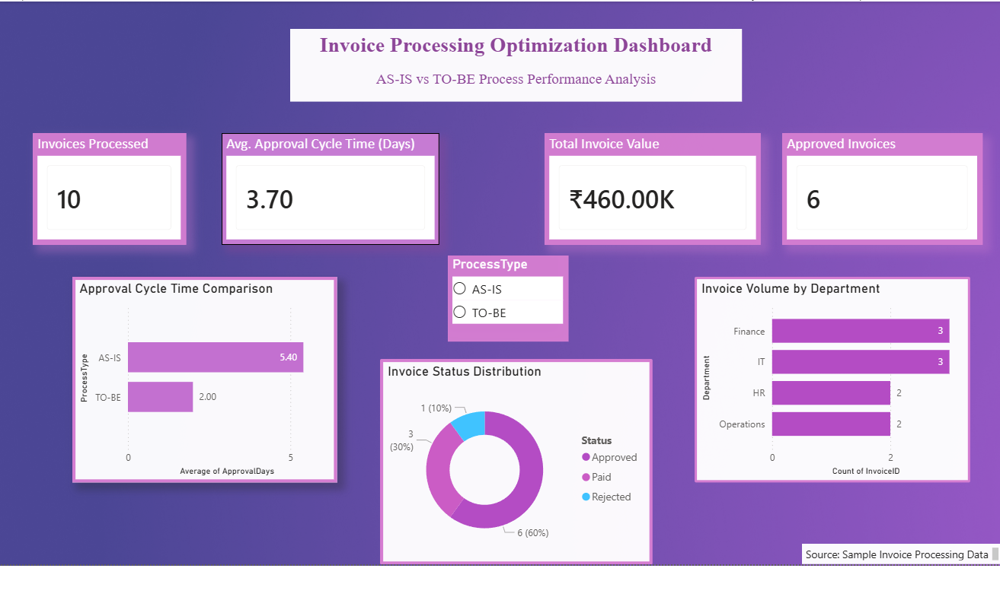

# Invoice Processing Workflow Optimization

## Dashboard Preview

## Project Overview

This project analyzes and improves the invoice processing workflow using Business Analysis techniques.

## Objectives

- Reduce approval delays
- Improve invoice tracking
- Minimize manual effort
- Enhance visibility

## Deliverables

### BRD
- Business Requirements Document

### BPMN Process Diagrams
- AS-IS Process Flow
- TO-BE Process Flow

### Gap Analysis
- Process gap identification and recommendations

### Power BI Dashboard
- KPI tracking
- Approval cycle comparison
- Status distribution
- Department analysis

## Tools Used

- Draw.io
- Microsoft Word
- Excel
- Power BI

## Key Improvements

- OCR-based invoice extraction
- Automated validation
- Workflow routing
- SLA monitoring
- Real-time status tracking

## Outcome

Reduced approval cycle time from approximately 5.4 days to 2 days through process automation and workflow optimization.
